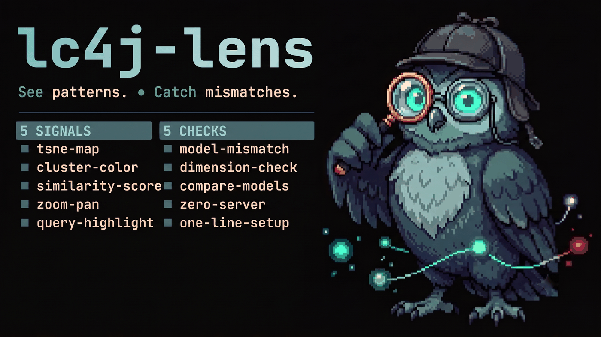
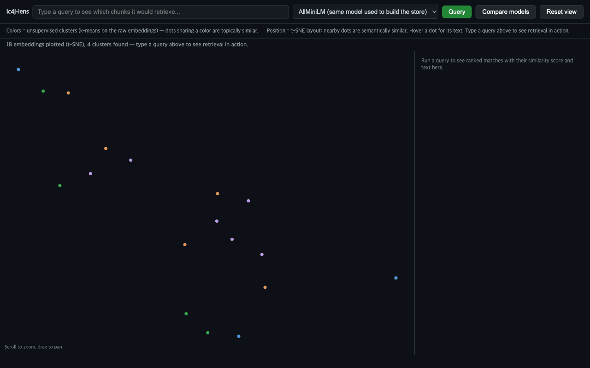
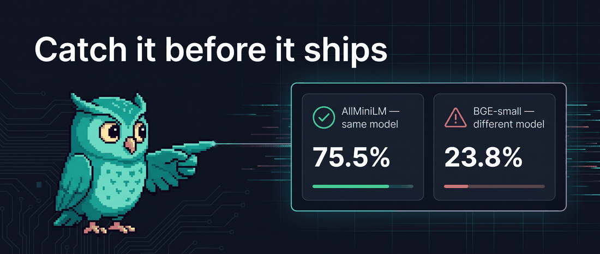

# lc4j-lens

[](LICENSE)
[](pom.xml)
[](CONTRIBUTING.md)



Your RAG returns the wrong chunk. Was the retriever bad, or did you just
query with the wrong embedding model? `lc4j-lens` answers that in one line
of code: a t-SNE map of your LangChain4j `EmbeddingStore`, live similarity
scores for any query you type, and a side-by-side "what if I embedded the
query differently" comparison.



## 30 seconds to your first "oh, THAT'S why"

```java
EmbeddingStore<TextSegment> store = ...;   // your existing store, already populated
EmbeddingModel embeddingModel = ...;       // the model you embedded it with

LensLauncher.launch(store, embeddingModel);
// -> lc4j-lens: plotted 1,842 embeddings at http://localhost:7477
```

Open the URL, type a query, and see which chunks light up — and why.

## What you get

- **t-SNE, not PCA.** Dots that are close together are actually semantically
  close (preserved local neighbor structure), not just "share the two
  directions of largest variance." PCA looked like a constellation of
  unrelated points; t-SNE actually clusters what's actually similar.
- **k-means topic clusters**, shown before you even type a query — the
  initial view already tells you how many topics your store holds.
- **Live similarity gradient.** Every point is shaded by its cosine
  similarity to your query, not just a binary top-K cutoff, plus a ranked
  results panel with the real score and the matched text.
- **Model-mismatch detector.** Indexed with AllMiniLM, querying with BGE by
  accident? Switch the query model dropdown (or hit "Compare models") and
  lc4j-lens flags when the query embedding didn't come from the same model
  as the store, and shows you just how meaningless the resulting scores are.
- **Zoom & pan** on the scatter plot, mouse wheel + drag.
- **Zero server, zero DB, zero API key.** One JDK `HttpServer`, one browser
  tab, nothing to configure.



## How it works

- [`TsneProjector`](src/main/java/io/lc4jlens/TsneProjector.java) projects
  embedding vectors to 2D with [bh-tsne](https://github.com/javagl/bh-tsne)
  (Barnes-Hut t-SNE). t-SNE has no out-of-sample extension, so every query
  re-fits the *whole* layout (stored points + the query vector together) —
  see the class javadoc for the trade-off.
- [`KMeans`](src/main/java/io/lc4jlens/KMeans.java) clusters the raw
  embeddings (not the 2D layout) so the pre-query view shows structure.
- [`LensServer`](src/main/java/io/lc4jlens/LensServer.java) serves the UI
  and two JSON endpoints (`/api/points`, `/api/query`) over a plain
  `com.sun.net.httpserver.HttpServer` — no servlet container, no Spring
  context required to run the viewer itself.
- Query highlighting re-embeds your query text (with whichever registered
  model you pick) and ranks stored points by cosine similarity.

### Comparing multiple query models

```java
Map<String, EmbeddingModel> queryModels = new LinkedHashMap<>();
queryModels.put("store model", embeddingModel);
queryModels.put("alternate model", someOtherEmbeddingModel);

LensLauncher.launch(store, embeddingModel, queryModels, 7477, 5000);
```

The first entry is treated as the store's own model; querying with any
other entry triggers the mismatch warning in the UI.

## Limitations

- `EmbeddingStore` has no universal "list everything" method. For
  `InMemoryEmbeddingStore`, lc4j-lens uses its public `size()` to request
  every entry exactly (no sampling). For any other store type, it
  approximates a full dump via a nearest-neighbor search with a large
  `maxResults` against a neutral probe embedding; for stores much larger
  than `maxPoints` (default 5,000) that's a sample, not the full set.
- Re-fitting t-SNE on every query is roughly O(n log n); fine up to a few
  thousand points, but not built for very large stores.
- The model-mismatch check compares model *names*, not the actual vector
  spaces — it can't detect a mismatch if you register the wrong model under
  the "store model" name.

## Build, test, and try it locally

```
mvn test                              # unit + end-to-end self-checks
mvn -q test-compile exec:java -Pdemo  # runs a local demo store and opens a server on :7477
```

## Contributing

See [CONTRIBUTING.md](CONTRIBUTING.md) — there are a few concrete
good-first-issue-shaped gaps listed there.

## License

[MIT](LICENSE)
